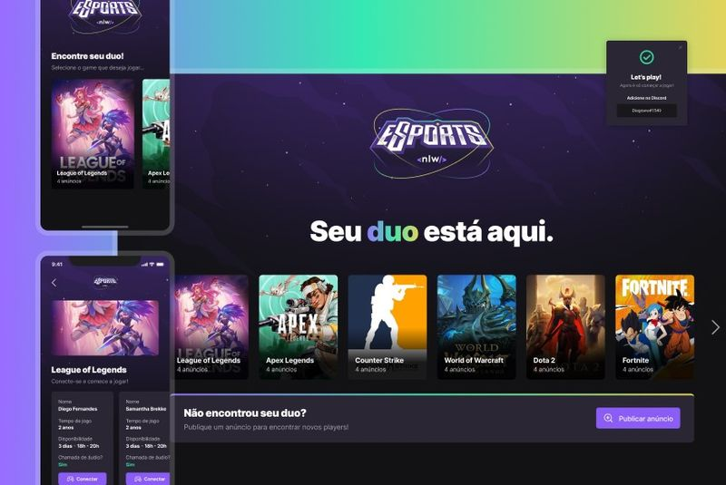

<h1 align="center">
    
</h1>

  

  
  
  

  

  

  <a href="#rocket-tecnologias">Tecnologias</a>&nbsp;&nbsp;&nbsp;|&nbsp;&nbsp;&nbsp;
  <a href="#-projeto">Projeto</a>&nbsp;&nbsp;&nbsp;|&nbsp;&nbsp;&nbsp;
  <a href="#-layout">Layout</a>&nbsp;&nbsp;&nbsp;|&nbsp;&nbsp;&nbsp;
  <a href="#-como-contribuir">Como contribuir</a>&nbsp;&nbsp;&nbsp;|&nbsp;&nbsp;&nbsp;
  <a href="#memo-licença">Licença</a>

 

  

## :rocket: Tecnologias

Esse projeto foi desenvolvido com as seguintes tecnologias:

- [Node.js](https://nodejs.org/en/)
- [React](https://reactjs.org)
- [React Native](https://facebook.github.io/react-native/)
- [Expo](https://expo.io/)

## 💻 Projeto

Se você já dominou os fundamentos da programação e quer levar suas habilidades para o próximo nível desenvolvendo uma aplicação completa, essa é a sua missão.  Aqui você você vai desenvolver a versão web e mobile do Find your Duo, uma plataforma que ajuda gamers a encontrar um parceiro ou parceira para jogar online seu game favorito, conectado a Twitch.

## 🔖 Layout

Você pode baixar o layout do projeto no formato `.sketch` através [desse link](https://www.figma.com/community/file/1150897317533332617).

Para abrir o arquivo no formato `.sketch` em qualquer sistema operacional utilize a ferramenta [Figma](https://figma.com).

## 🤔 Como contribuir

- Faça um fork desse repositório;
- Cria uma branch com a sua feature: `git checkout -b minha-feature`;
- Faça commit das suas alterações: `git commit -m 'feat: Minha nova feature'`;
- Faça push para a sua branch: `git push origin minha-feature`.

Depois que o merge da sua pull request for feito, você pode deletar a sua branch.

## :memo: Licença

Esse projeto está sob a licença **MIT**. Veja o arquivo [LICENSE](LICENSE) para mais detalhes.

---
